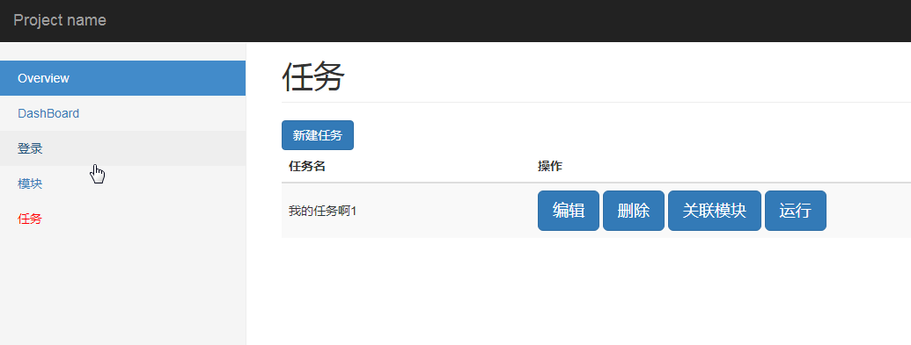

# 项目名及简介
* web自动化接口测试平台

## 概述
* python 3.4.x
* django 2.0.8
* jquery页面和后台交互
* bootstrap3.3 页面框架
* 自动生成模糊用例(支持window平台)


## 如何使用

* 在登录菜单维护登录信息
- 新建模块
- 新建用例
	- 管理模糊用例（基于PICT自动生成，暂时只支持windows平台），在lib目下有安装文件
- 任务管理，关联模块，然后运行任务
- 在DashBorad中查看报告


## 运行
- 直接用本机ip或者127.0.0.0:8080/api访问即可

```
python manage.py runserver 0.0.0.0:8000

```


## 结果展示




# 其他 
* [配置说明](use.md)
* [changelog](CHANGELOG.md)


