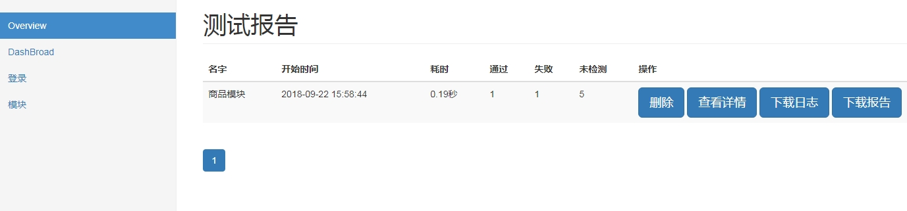
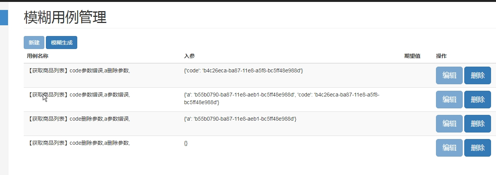
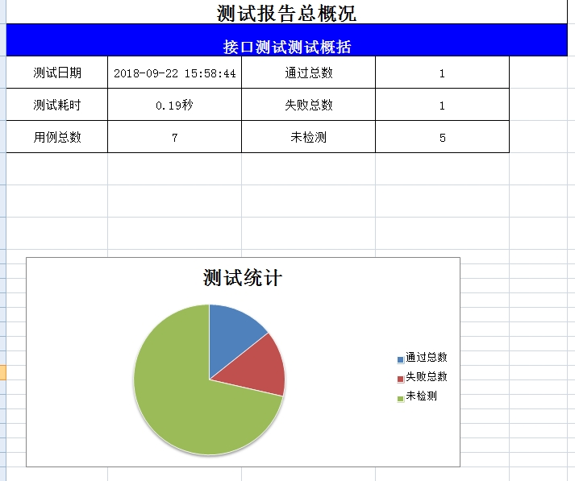

# 项目名及简介
* web自动化接口测试平台

## 概述
* python 3.4.x
* django 2.0.8
* jquery页面和后台交互
* bootstrap3.3 页面框架
* 自动生成模糊用例(支持window平台)


## 如何使用

* 在登录菜单维护登录信息
* 新建模块
    * 新建用例
      * 再用例下可自动生成模糊用例
* DashBroad：为测试报告


## 运行
- 为本机ip

```
python manage.py runserver 192.168.1.100:8000

```

## 结果展示






# 其他 
* [配置说明](use.md)
* [changelog](CHANGELOG.md)


